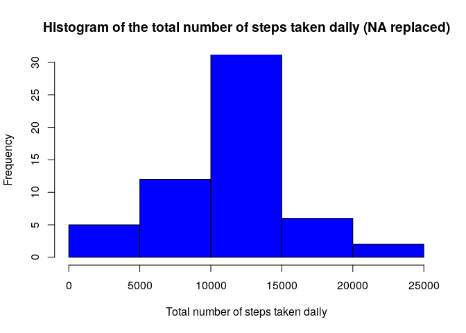

### Loading and preprocessing the data


```r
zipUrl <- "https://d396qusza40orc.cloudfront.net/repdata%2Fdata%2Factivity.zip"
zipFile <- "repdata data activity.zip"
```

• Download zip file containing data if this hasn't already happened

```r
if (!file.exists(zipFile)) {
        download.file(zipUrl, zipFile, mode = "wb")
}
unzip(zipFile)
```
• Create a data frame from the csv file

```r
activity <- read.csv("activity.csv")
```
• Change date format into date

```r
activity$date<-as.Date(activity$date)
```
### What is mean total number of steps taken per day?
1. Calculate the total number of steps taken per day

```r
sum.day<-aggregate(activity$steps,by=list(activity$date),FUN=sum,na.rm=TRUE)
```
2. Make an histogram of the total number of steps taken each day

```r
hist(sum.day[,2], xlab = "Total number of steps taken daily", col = "blue", 
     ylim = c(0, 30), main = "Histogram of the total number of steps taken daily (NA removed)")
```

<!-- -->
<br/><br/>
&nbsp;&nbsp;&nbsp;&nbsp;
3. Calculate and report the mean and median of the total number of steps taken per day

```r
mean(sum.day[,2])
```

```
## [1] 9354.23
```

```r
median(sum.day[,2])
```

```
## [1] 10395
```
## What is the average daily activity pattern?
1. Make a time series plot (i.e. <span style="color:red"> type = "l" </span> of the 5-minute interval (x-axis) and the average number of steps taken, averaged across all days (y-axis)

```r
avg.interv<-aggregate(activity$steps,by=list(activity$interval),FUN=mean,na.rm=TRUE)
plot(avg.interv, type = "l", col="blue", xlab="Intervals", ylab="Average number of steps", main="Average number of steps per interval")
```

<!-- -->
<br/><br/>
&nbsp;&nbsp;&nbsp;&nbsp;
2. Which 5-minute interval, on average across all the days in the dataset, contains the maximum number of steps?

```r
avg.interv[which(avg.interv[,2] == max(avg.interv[,2])),1]
```

```
## [1] 835
```


## Imputing missing values
1. Calculate and report the total number of missing values in the dataset (i.e. the total number of rows with <span style="color:red"> NAs</span>)

```r
sum(is.na(activity$steps))
```

```
## [1] 2304
```
2. Devise a strategy for filling in all of the missing values in the dataset. The strategy does not need to be sophisticated. For example, you could use the mean/median for that day, or the mean for that 5-minute interval, etc.
3. Create a new dataset that is equal to the original dataset but with the missing data filled in.

```r
activity2 <- activity
activity2$steps[which(is.na(activity2$steps))] <- avg.interv[which(avg.interv==activity[which(is.na(activity$steps)),3]),2]
```
4. Make a histogram of the total number of steps taken each day and calculate and report the **mean** and **median** total number of steps taken per day. Do these values differ from the estimates from the first part of the assignment? What is the impact of imputing missing data on the estimates of the total daily number of steps?

```r
sum.day2<-aggregate(activity2$steps,by=list(activity2$date),FUN=sum,na.rm=TRUE)
hist(sum.day2[,2], xlab = "Total number of steps taken daily", col = "blue", 
     ylim = c(0, 30), main = "Histogram of the total number of steps taken daily (NA replaced)")
```

<!-- -->

```r
mean(sum.day2[,2])
```

```
## [1] 10766.19
```

```r
median(sum.day2[,2])
```

```
## [1] 10766.19
```
## Are there differences in activity patterns between weekdays and weekends?
Create a new factor variable in the dataset with two levels – “weekday” and “weekend” indicating whether a given date is a weekday or weekend day. Make a panel plot containing a time series plot (i.e. <span style="color:red"> type = "l" </span> of the 5-minute interval (x-axis) and the average number of steps taken, averaged across all weekday days or weekend days (y-axis). See the README file in the GitHub repository to see an example of what this plot should look like using simulated data.

1. Convert date into weekdays

```r
activity$days=tolower(weekdays(activity$date))
```
2. Now categorised days into weekend and weekdays

```r
activity$day.type<-ifelse(activity$days=="saturday"|activity$days=="sunday","weekend","weekday")
```
3. Take mean steps taken on weekend or weekday in the intervals

```r
avg.steps<-aggregate(activity$steps,by=list(activity$interval,activity$day.type),FUN=mean,na.rm=TRUE)

colnames(avg.steps)<-c("interval","day.type","steps")
```
4.  Create panel plot between average steps and interval seperated by day type

```r
#Load ggplot library
library(ggplot2)
ggplot(aes(x=interval,y=steps),data=avg.steps)+facet_wrap(~avg.steps$day.type)+geom_line()
```

<!-- -->
